<p align="center">
  
</p>

<h1 align="center">PANE</h1>

<p align="center"><strong>A transparent window into your system.</strong></p>

<p align="center">
Your OS hides what your hardware is actually doing. Pane cracks it open.<br>
Per-process VRAM. Real GPU metrics. Hardware controls. One binary. ~5MB. No bloat.
</p>

<p align="center">
  <a href="#features">Features</a> &bull;
  <a href="#install">Install</a> &bull;
  <a href="#why-pane">Why Pane</a> &bull;
  <a href="#platform-support">Platforms</a> &bull;
  <a href="#current-limitations">Limitations</a> &bull;
  <a href="#build-from-source">Build</a>
</p>

---

<p align="center">
  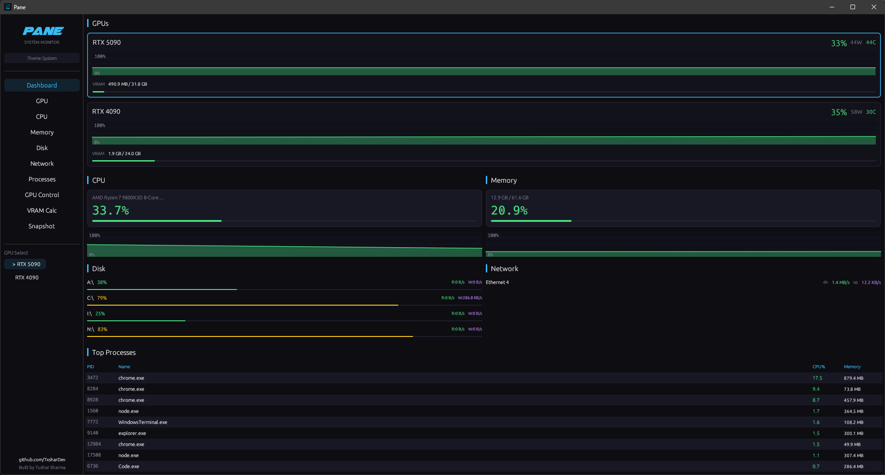
</p>

<p align="center">
  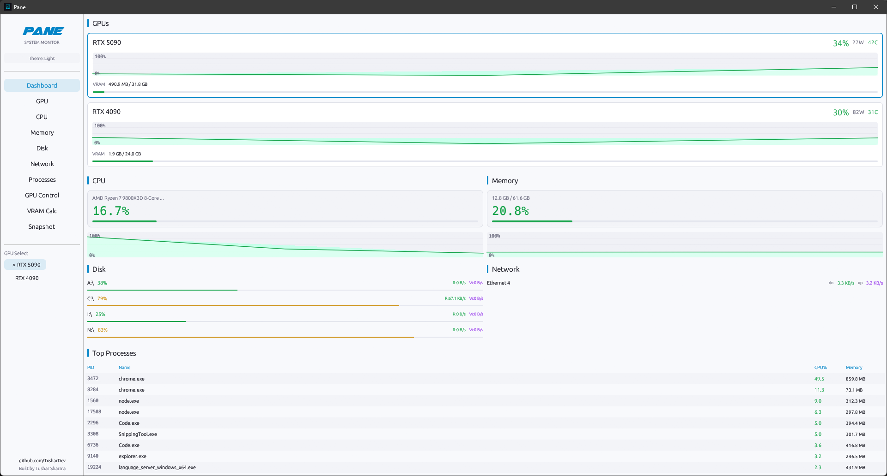
</p>

---

## Features

### Dashboard

Your whole system. One screen. Both GPUs charting utilization in real time, CPU load, RAM pressure, disk IO, network throughput, and your hungriest processes - all updating live without switching a single tab.

### GPU

This is why Pane exists. Utilization with filled-area charts. VRAM with history. Power draw trending over time. Core and memory clocks. Thermals - core and hotspot, charted. Fan speed. PCIe bandwidth both directions. And the part nobody else gives you: a per-GPU process table showing exactly which app is eating your VRAM and how much.

Dual GPU? Switch between cards with one click.

<p align="center">
  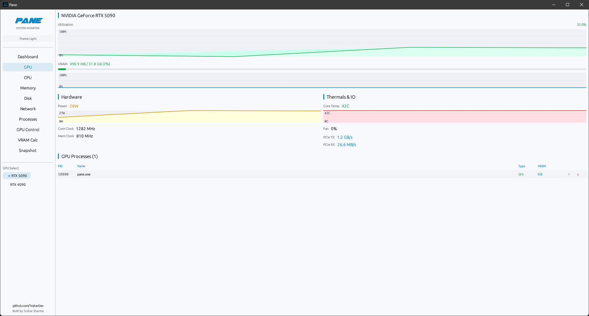
</p>

### CPU

Total usage charted over time with every core broken out individually - utilization and frequency, live.

<p align="center">
  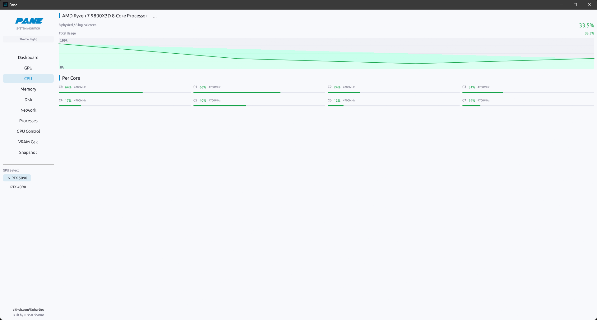
</p>

### Memory

How much RAM you're actually using, how much is left, and whether your swap is getting hit. History chart so you can see if something's been leaking.

<p align="center">
  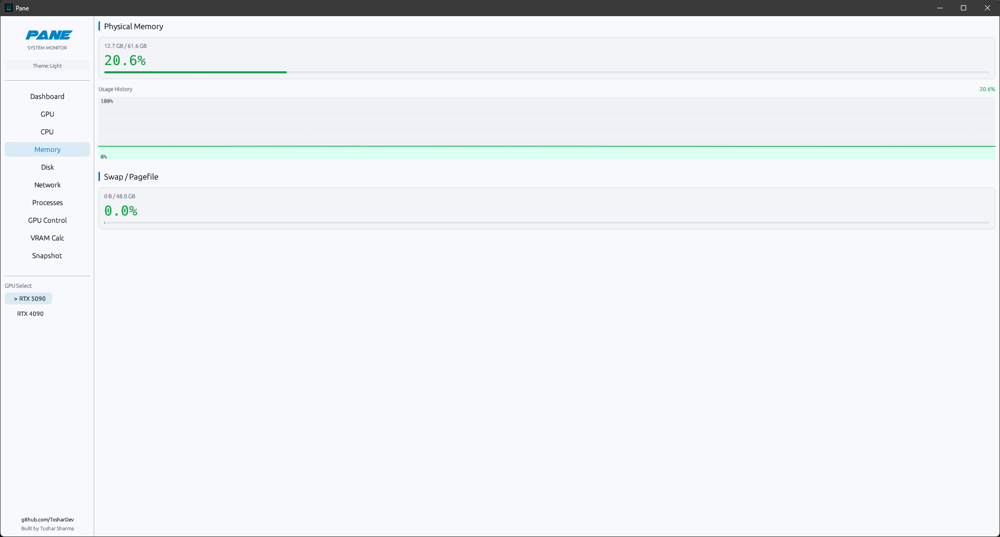
</p>

### Disk

Every drive. Capacity, usage, and live read/write throughput so you know when something's hammering your SSD.

<p align="center">
  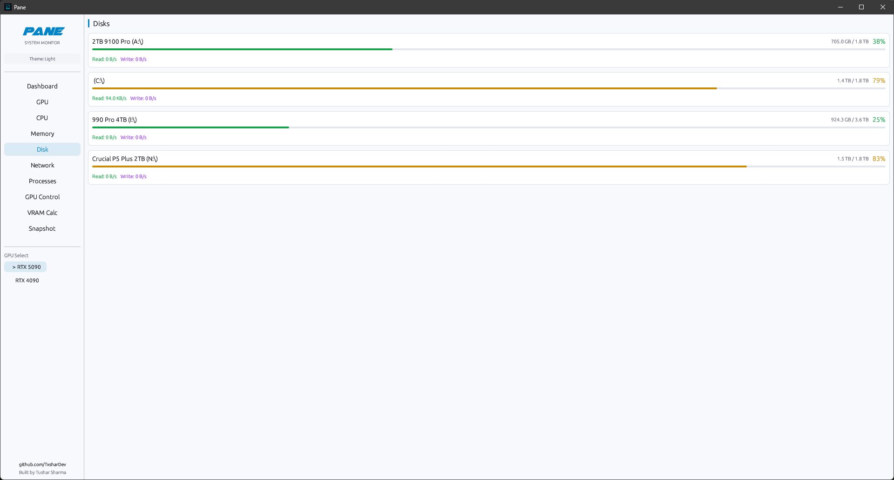
</p>

### Network

Per-interface download and upload rates with session totals. See what's actually moving data.

<p align="center">
  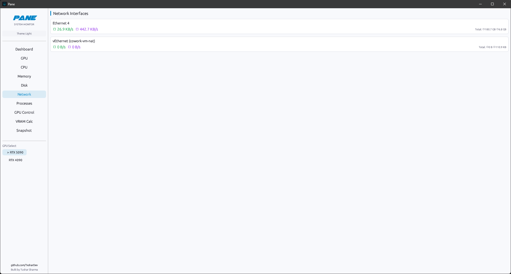
</p>

### Processes

Full process table with **GPU% and VRAM columns** that actually work (via Windows PDH - same data source as Task Manager). Sort by any column. Filter instantly. Close or force-kill with confirmation. Don't recognize a process? Hit the search button.

<p align="center">
  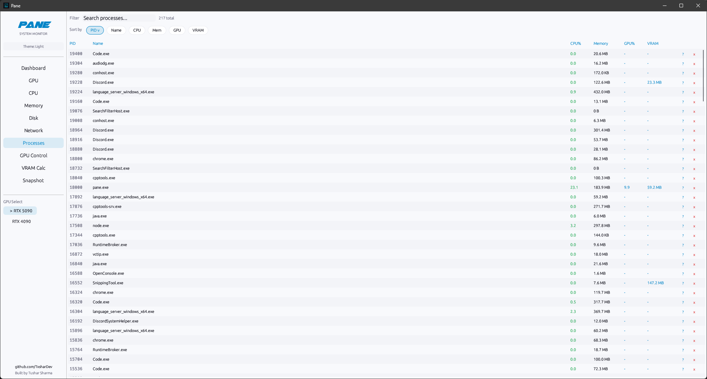
</p>

### GPU Control

Power limit slider wired directly to NVML - it actually changes your card's power target. Requires admin, and Pane tells you upfront with a clear banner instead of silently failing. Fan speed and clock offsets coming soon (NVAPI), labeled honestly.

<p align="center">
  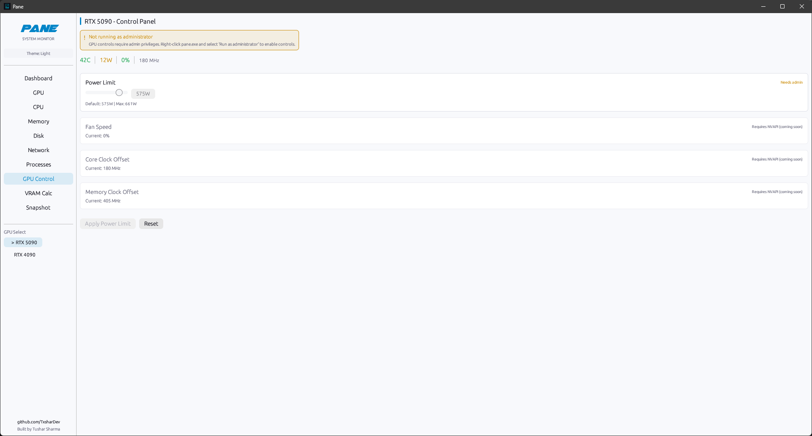
</p>

### VRAM Calculator

53GB of VRAM across two cards - can you run Llama 70B at Q4? This panel answers that. 9 models, every quant level, context estimates, multi-GPU split indicators. No more napkin math.

<p align="center">
  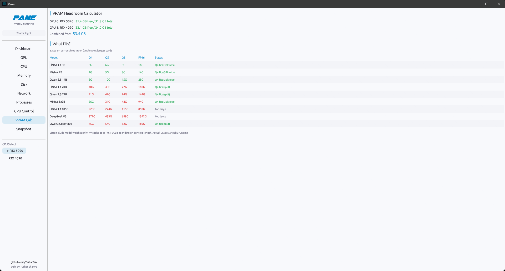
</p>

### Performance Snapshot

One click generates a clean text dump of every metric in your system. Copy to clipboard or save to file. Formatted so you can drop it straight into a Reddit post, GitHub issue, or Discord message without editing.

<p align="center">
  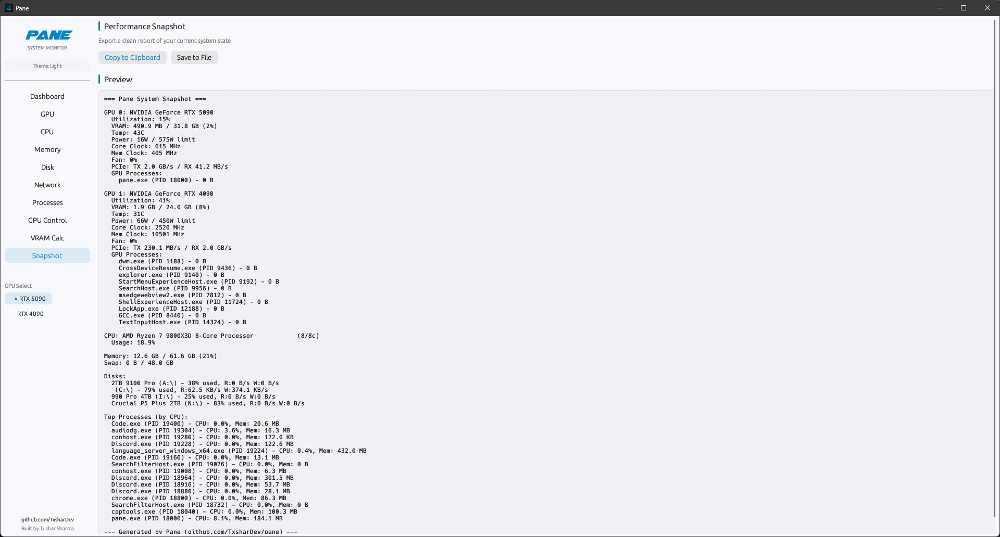
</p>

### The details

- **Dark / Light / System theme** - proper palette swap, not just inverted colors
- **Click-to-copy** any value with full-precision tooltips
- **Config persistence** - remembers your theme, window size, refresh rate across launches
- **No console window** - pure GUI app on Windows, no terminal flashing
- **Background metric thread** - UI never stutters, data collection is off the render path
- **Custom branding** with embedded font and icon
- **~5MB single binary** - no installer, no runtime, no dependencies

---

## Install

Grab the latest release from [**Releases**](https://github.com/TxsharDev/pane/releases).

| Platform | File |
|----------|------|
| Windows x64 | `pane-windows-x64.exe` |
| Linux x64 | `pane-linux-x64` |
| macOS x64 | `pane-macos-x64` |
| macOS ARM64 | `pane-macos-arm64` |

No installer. No runtime. No dependencies. NVIDIA drivers required for GPU metrics.

---

## Why Pane

If you're running a high-end Windows rig - especially dual NVIDIA GPUs - there is no single tool that gives you deep, accurate GPU visibility without admin requirements for basic monitoring, without bloat, and without looking like it was designed in 2006.

You either get sensor dumps with no context (HWiNFO), gaming overlays that can't show per-process data (Afterburner), or a Task Manager that thinks one GPU percentage is enough information. Meanwhile you're alt-tabbing between four apps trying to figure out which Chrome tab is eating 3GB of VRAM.

Pane fixes that.

| Tool | What's missing |
|------|----------------|
| **Task Manager** | One GPU percentage. No per-engine breakdown, no PCIe, no thermals, no power. |
| **HWiNFO** | Deep sensors, but no per-process GPU data. UI hasn't changed in 20 years. |
| **Process Explorer** | No GPU awareness. No meaningful updates in years. |
| **Afterburner** | Gaming overlay being discontinued. No per-process data. |
| **btop** | Excellent on Linux. Windows is a separate fork, an afterthought. |
| **bottom** | Solid Rust TUI. GPU support is surface-level. |
| **nvidia-smi** | Text dump. Per-process VRAM broken on consumer GPUs (WDDM). |

---

## Platform Support

| Feature | Windows | Linux | macOS |
|---------|---------|-------|-------|
| CPU, RAM, Disk, Network | Full | Full | Full |
| GPU metrics (NVIDIA) | Full (NVML + PDH) | Basic (NVML) | Limited |
| Per-process GPU % | Yes (PDH) | No | No |
| Per-process VRAM | Yes (PDH) | No | No |
| GPU Control | Power limit (NVML) | Power limit (NVML) | No |
| AMD GPU | Planned | Planned | No |

**Windows with NVIDIA is the primary target.** Linux and macOS get solid system monitoring with basic GPU support where drivers allow.

### How per-process GPU data works

NVIDIA's NVML returns `NOT_AVAILABLE` for per-process VRAM on consumer GPUs running WDDM. Most tools stop here and show you nothing useful.

Pane uses **Windows Performance Counters (PDH)** - the same data source Task Manager reads internally. GPU Engine counters for per-process utilization across engines (3D, decode, encode, copy). GPU Process Memory counters for dedicated + shared VRAM per process. No admin elevation needed. Works across NVIDIA, AMD, and Intel GPUs.

PDH values may have minor variances compared to nvidia-smi (different API path). Dedicated memory tracking can lag slightly, and some driver-level allocations may not be attributed to specific processes. This is the same data and the same accuracy as Task Manager.

---

## Current Limitations

- **Fan speed and clock offsets** need NVAPI (not yet integrated). Only power limit control works today.
- **GPU Control requires admin** - monitoring works without elevation, but changing power limits needs it. Pane shows this clearly.
- **Per-process GPU data is Windows-only** - no PDH equivalent on Linux/macOS with the same depth.
- **AMD GPU support** is planned but not implemented yet.
- **PDH collection** uses PowerShell internally, adding ~100ms overhead per cycle.

---

## Build from source

```bash
git clone https://github.com/TxsharDev/pane.git
cd pane
cargo build --release
```

Binary at `target/release/pane.exe` (Windows) or `target/release/pane` (Linux/macOS). Requires Rust 1.85+.

---

## Tech Stack

Immediate-mode GUI via [egui](https://github.com/emilk/egui) with hardware-accelerated rendering (eframe, glow backend). System metrics via [sysinfo](https://github.com/GuillaumeGomez/sysinfo). NVIDIA GPU via [nvml-wrapper](https://github.com/Cldfire/nvml-wrapper). Per-process GPU on Windows via [windows-rs](https://github.com/microsoft/windows-rs) PDH. CI builds for Windows, Linux, macOS (x64 + ARM64) via GitHub Actions.

---

## Contributing

MIT License. Contributions welcome.

**High-impact areas:**
- AMD GPU support (ADLX FFI)
- Linux GPU depth (/sys/class/drm)
- NVAPI integration (fan, clocks)
- UI/UX and widget improvements

```bash
cargo run             # Debug
cargo build --release # Release
cargo clippy          # Zero warnings policy
```

---

<p align="center">
  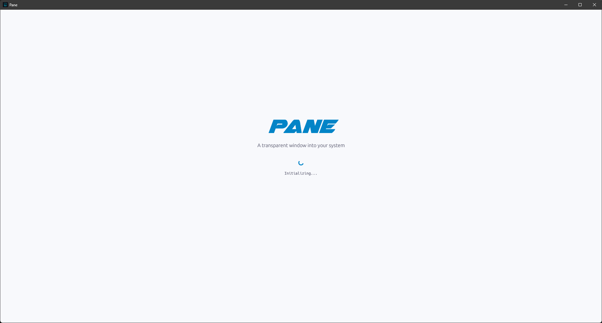
</p>

<p align="center">
  <strong>Built by <a href="https://github.com/TxsharDev">Tushar Sharma</a></strong><br>
  Your hardware is doing more than your OS wants you to see. Pane shows you all of it.
</p>
